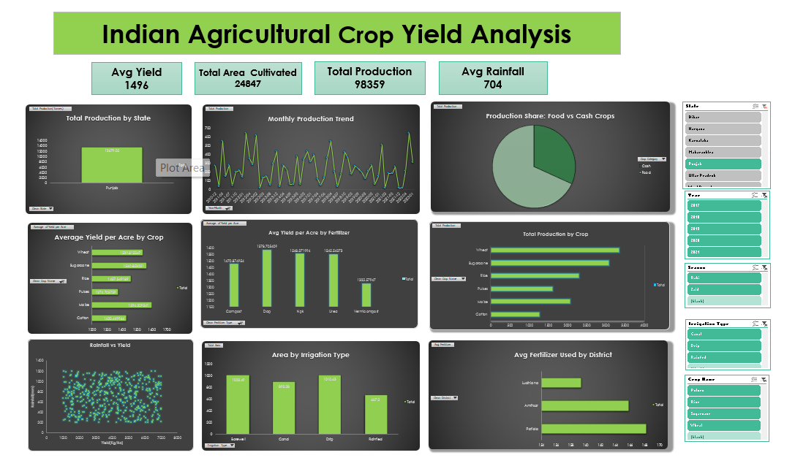

# Indian-Agricultural-Crop-Yield-Analysis

## 📌 Project Overview
An Excel-based analysis of Indian agricultural crop yield data across multiple states and districts. The project covers the full workflow: data understanding, cleaning, transformation, and an interactive dashboard built with PivotTables, PivotCharts and Slicers.

## 🎯 Objectives
- Understand crop yield trends across states and districts
- Identify the most and least productive crops
- Analyze the effect of irrigation, fertilizer type and climate
- Build an interactive dashboard for agricultural monitoring

## 📂 Dataset
Indian Agricultural Crop Yield data with 500 records. Key columns: State, District, Year, Season, Crop Name, Area (Hectares), Production (Tonnes), Yield (Kg/Ha), Irrigation Type, Fertilizer Type, Fertilizer Used (Kg), Rainfall (mm), Soil Type, Temperature (Celsius).

## 🧹 Data Cleaning & Transformation
- Removed blank rows and checked for duplicates
- Standardized text using TRIM and PROPER (State, District, Crop, Fertilizer Type)
- Created new columns: Year-Month, Yield per Acre, Fertilizer Efficiency, Crop Category (Food / Cash)

## 📊 Dashboard KPIs
| KPI | Value |
|---|---|
| Avg Yield | 1496 |
| Total Area Cultivated | 24847 |
| Total Production | 98359 |
| Avg Rainfall | 704 |

## 🔍 Key Insights
- Maize has the highest average yield per acre, while Sugarcane has the lowest
- Cotton and Pulses contribute the highest total production
- Vermicompost shows the highest average yield per acre among fertilizer types, NPK the lowest
- Rainfall shows no clear relationship with yield in this dataset

## 🛠️ Tools & Techniques
Microsoft Excel, PivotTables, PivotCharts, Slicers, Data Cleaning, Conditional Formatting

## 📁 Files
- `laxman-444.xlsx`: Complete Excel workbook with the dashboard
- `dashboard.png`: Dashboard screenshot

## 👤 Author
Laxman Thorwat
